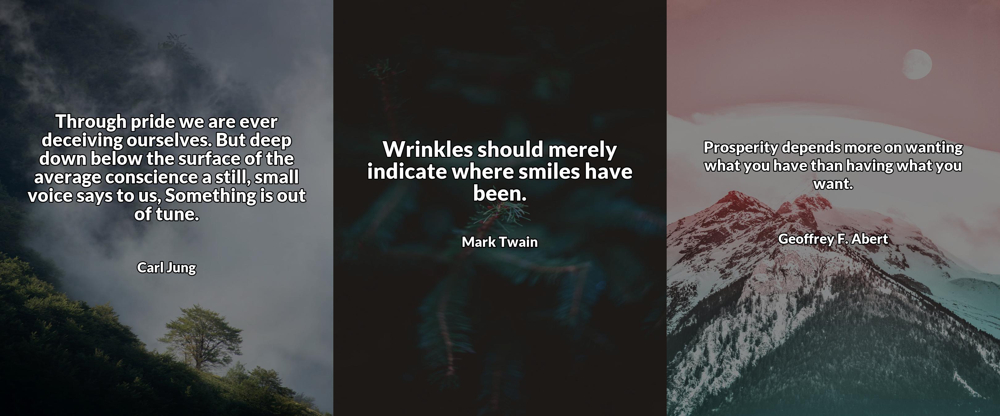

# Inspirational Quotes Image Generator

**More information about this project can be found in [this article on my website](https://rivenintech.com/projects/inspirational-quotes-image-generator-python).**

Generate images with inspirational quotes like these:



## Installation

Before running the code, you need to install the required libraries. Run one of the following commands in your terminal:

```sh
# Using pip
pip install -r requirements.txt

# Using Poetry
poetry install
```

## Getting a Pexels API Key

Visit the [Pexels site and create an account](https://www.pexels.com/api/). After that, you get your API key. Then create a `.env` file in the root directory of the project and add the following line to it:

```sh
PEXELS_KEY=<your-api-key>
```
